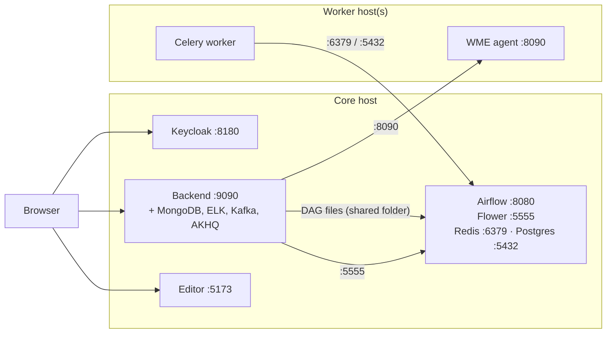

# Requirements & topology

## Software

- **Docker Engine** with the **Compose plugin** on every host.
- **openssl** on the host where you run the MVP `setup.sh` (it generates secrets).
- Access to `ghcr.io` (images `ghcr.io/datacrop/maize-model-repository/wme-server` and `ghcr.io/datacrop/maize-workflow-management-editor/wme-ui`). Run `docker login ghcr.io` if your network requires it.

## Sizing

The Airflow initializer warns below **4 GB RAM, 2 CPUs and 10 GB disk** for Airflow alone. A single host running everything (Elastic stack, Airflow, Kafka, Keycloak, MongoDB, a worker and your processors) is comfortable with **16 GB RAM, 4+ CPUs and 50 GB disk**. Workers need whatever your processors need, plus Docker.

## Topology

- The backend writes DAG files straight into Airflow's `dags/` folder through a bind mount, so **the backend and the Airflow webserver/scheduler must run on the same host** (or share that folder).
- Workers can run anywhere that can reach Airflow's **Redis (6379)** and **Postgres (5432)**, and that the backend can reach on **8090**.
- Browsers need to reach the editor, Keycloak, the backend API, the assistant runtime (preview), Kibana (embedded views), Airflow (admin iframe) and AKHQ (links).

## Ports

| Port | Service | Who connects |
|---|---|---|
| 5173 | Workflow Editor (nginx) | Browsers |
| 8180 | Keycloak (admin console at `/admin`) | Browsers, backend |
| 9090 | Model Repository API (Swagger at `/swagger-ui/index.html`) | Browsers, assistant-runtime |
| 8200 | assistant-runtime *(preview, runs in the backend stack)* | Browsers |
| 27017 | MongoDB | Backend |
| 9200 / 9300 | Elasticsearch | Backend, Logstash, Kibana |
| 5601 | Kibana | Browsers, backend |
| 9600 / 5044 / 50000 | Logstash monitoring / Beats / TCP | Backend / data sources |
| 9092 | Kafka | Processors, Logstash |
| 8081 | AKHQ | Browsers |
| 8080 | Airflow webserver | Browsers (admins), backend |
| 5555 | Flower | Backend |
| 6379 / 5432 | Redis / Postgres (Airflow) | Workers |
| 8090 | WME agent on each worker | Backend only |

:::warning[Keep 8090 private]
Only the agent's `/runtime/*` endpoints check the shared `WME_SERVICE_TOKEN`; its DAG and folder endpoints do not. Expose port 8090 to the backend host only (firewall or private network).
:::
