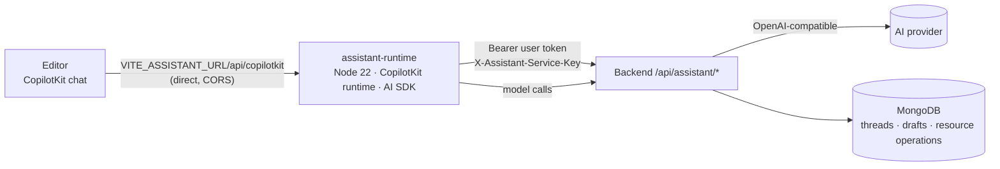

# Assistant runtime (preview)

The Workflow Assistant is split into three parts:

## assistant-runtime

`maize-model-repository/assistant-runtime/server.mjs` (on `dev/ai-feature`). It is deployed in the backend Compose stack next to `wme-server`, because everything it does goes through the backend and it shares the backend's service key and Keycloak settings.

- **Networking** — the browser calls the runtime directly at `VITE_ASSISTANT_URL` (default `http://VITE_BACKEND_IP:8200`), like it calls the backend API, so the editor's nginx is not involved. The runtime calls the backend at `WME_BACKEND_URL`, which Compose sets to `http://wme-server:${SERVER_PORT}` on the shared Docker network.
- **CORS** — handled in the runtime's HTTP server before token checks, so preflights and 401 responses carry the headers. Allowed origins come from `ASSISTANT_CORS_ORIGINS` (comma-separated, default `*`).

- **Authentication** — every request must carry the user's Keycloak bearer token; it is verified against `KEYCLOAK_JWK_SET_URI` / `KEYCLOAK_ISSUER_URI` (`jose`). The token and user id are kept in request context.
- **Backend calls** — `${WME_BACKEND_URL}/api/assistant/...` with the user's token **and** `X-Assistant-Service-Key: ${ASSISTANT_SERVICE_KEY}`.
- **Model** — an OpenAI-compatible provider (`@ai-sdk/openai-compatible`) whose base URL is the backend's `/api/assistant/model/v1`. The backend forwards to the server default or the user's own provider, so API keys stay in the backend.
- **Agents** — `default` (can use tools; drafts workflows) and `qa` (no tools; answers from a catalogue snapshot).
- Listens on `PORT` (default **8200**); `GET /healthz` is an unauthenticated health check.
- Active runs are held in memory (`InMemoryAgentRunner`), so run a single instance. Conversations are stored in MongoDB by the backend.
- Tests: `npm test` in `assistant-runtime/` (Node 22+).

### Tools

| Tool | Backend call | Writes? |
|---|---|---|
| `search_catalog` | `GET /catalog/{kind}` | No |
| `inspect_data_interface` | `GET /catalog/data-interfaces/{id}/requirements` | No |
| `create_data_kind` | `POST /resources/data-kinds` | Yes (immediately) |
| `create_digital_resource` | `POST /resources/digital-resources` | Yes; returns `NEEDS_INPUT` when secrets are required → secure form completes via `POST /resource-operations/{id}/complete` |
| `get_workflow` | `GET /workflows/{id}` | No |
| `workflow_rules` | `GET /rules` | No |
| `check_worker_readiness` | `GET /catalog/worker-readiness` | No |
| `report_requirements` | — (rendered in the UI) | No |
| `create_workflow_draft` | `POST /drafts` | Draft only |
| `propose_workflow_edit` | `POST /drafts` | Draft only |

`propose_workflow_edit` operations: `set_workflow`, `add_processor`, `add_resource`, `remove_node`, `set_processor`, `set_resource`, `set_parameter`, `connect`, `disconnect`.

## Backend API (`/api/assistant`)

| Area | Endpoints |
|---|---|
| Threads | `GET/POST /threads`, `GET/PATCH/DELETE /threads/{id}`, `POST /threads/{id}/generate-title`, `POST /threads/{id}/messages`, `GET /threads/{id}/drafts`, `GET /threads/{id}/resource-operations` |
| Catalogue | `GET /catalog/{kind}`, `GET /catalog/data-interfaces/{id}/requirements`, `GET /catalog/worker-readiness`, `GET /rules`, `GET /workflows/{id}`, `GET /workflows/{id}/readiness` |
| Resources | `POST /resources/data-kinds`, `POST /resources/digital-resources`, `POST /resource-operations/{id}/complete` |
| Drafts | `POST /drafts`, `GET/PUT /drafts/{id}`, `POST /drafts/{id}/commit`, `/prepare-lab`, `/save-lab`, `/abandon-lab` |
| Model proxy | `POST /model/v1/chat/completions` |

All routes require an authenticated user; the service key proves the call comes from the runtime. Long agent turns are kept open by `spring.mvc.async.request-timeout` (`SPRING_MVC_ASYNC_REQUEST_TIMEOUT`, default 300 s).

## Lab integration

**Go to Lab** opens `/Lab?assistantDraft=<id>`. The Lab calls `prepare-lab` and loads the draft as an unsaved graph. **Save** / **Update** call `save-lab`; for edits of an existing workflow the backend first checks that the workflow has not changed since the draft was made, so concurrent edits are not overwritten.

## Status

The runtime and the backend API currently live on the `dev/ai-feature` branch of `maize-model-repository`; the chat UI is on the editor's `dev/ai-feature` branch. The MVP bundle does not deploy the runtime yet. Deployment steps: [Model Repository → assistant-runtime](/deploy/manual/model-repository/#assistant-runtime-preview).
