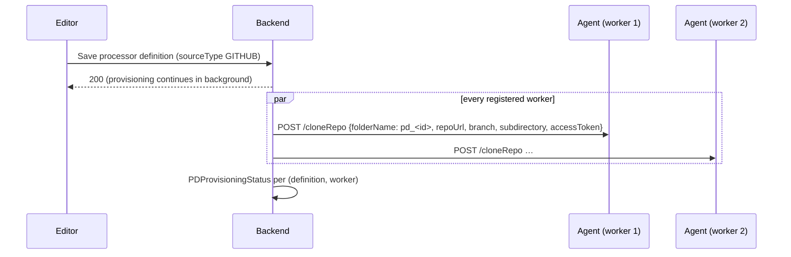

# How deployment works

This page follows a processor from its definition to a running container.

## 1. Provisioning (when a definition or a worker is saved)



- The agent runs `git clone --depth 1` (5-minute timeout) into `processors/pd_<id>` and checks that a compose file exists in the given subdirectory. Access tokens are embedded only for `https` URLs.
- Status rows (`PENDING`, `SUCCESS`, `FAILED` with error) are shown in the wizard's **Provisioning status**; **Re-provision** repeats the clone.
- Registering a new worker replays provisioning of every GitHub-based definition onto it.
- Single-container definitions need no provisioning — the image is pulled at run time.

## 2. Saving a workflow

The backend (`DagManager`) renders two Python files with Jinja templates (`executionDagTemplate.j2`, `executionDagTeardownTemplate.j2`):

- `DAG_<sanitized name>_<workflow id>.py` — deployment
- `DAG_teardown_<sanitized name>_<workflow id>.py` — teardown

It writes them to the Airflow webserver's DAG folder (`WEBSERVER_DAGS_FOLDER`) and sends them to **every** worker (`POST /createDag`), recording a `DagDistributionStatus` per worker. Updating a workflow removes and re-renders both files; deleting removes them.

The DAG's schedule comes from the workflow's DAG configuration (`schedule_interval`, `catchup`, start/end date). Tasks are ordered following the processor-to-processor edges of the graph, between a start (`task_0`) and a cleanup task.

## 3. One task per processor

Each processor becomes a `BashOperator` whose `queue` is the Celery queue of its **Worker Station** (`QUEUE_NAME`, falling back to the worker name). Celery delivers the task only to that worker.

### Compose processors

```bash
cd /opt/airflow/processors/pd_<definition id>
# .env.<task> ← processor parameters + derived resource variables
# .wme.<pm id>.override.yml ← adds wme.* labels to every service
docker compose --env-file ".env.<task>" -p "wme_<pm id>" \
  -f <compose file> -f ".wme.<pm id>.override.yml" up -d
```

### Single-container processors

```bash
docker login <registry> …            # if registry credentials exist
docker run -d --name <task> \
  --label wme.managed=true --label wme.processor-manifest-id=<pm id> … \
  -e KEY=value …  <containerImage>
```

### Environment

For every connected digital resource the backend adds one variable per parameter:

```text
<INTERFACE>_<KEY>_<DIRECTION>     e.g. KAFKA_TOPIC_ID_INPUT, ELASTICSEARCH_INDEX_OUTPUT
```

Derived variables override processor parameters with the same key. Kafka `topic_id` values have spaces replaced by underscores.

### Labels

| Label | Value |
|---|---|
| `wme.managed` | `true` |
| `wme.owner-id` | Keycloak user id of the workflow owner |
| `wme.processor-manifest-id` | Processor id in the workflow |
| `wme.processor-definition-id` | Definition id |
| `wme.worker-id` | Worker asset id |
| `wme.workflow-id` | Workflow id |
| `wme.deployment-type` | `compose` or `container` |

Worker Runtime uses these labels to match containers to processors and to find orphans.

## 4. Running

`POST /user/v1/dpe/registry/{id}/po/run` → the backend unpauses the DAG (`PATCH /dags/{dag_id}`) and triggers a run (`POST /dags/{dag_id}/dagRuns`) through Airflow's REST API. Airflow's Celery executor puts each task on its queue; the worker's Celery process runs the bash command on the host's Docker through the mounted socket.

## 5. Teardown

**Stop** triggers the teardown DAG: `docker compose -p wme_<pm id> down` for Compose processors, `docker stop` + `docker rm` for containers.

## 6. Runtime control

Worker Runtime calls `/user/v1/monitoring/workers/...` on the backend, which relays to the agent's `/runtime/*` endpoints with `X-WME-Service-Token` and `X-WME-Owner-Id`. Start / stop / restart act on the labelled containers directly — no Airflow run. See [Worker agent API](/developers/worker-agent-api/).

## Logstash pipelines are different

Logstash Pipeline processors never become DAG tasks. Saving one makes `LogstashManager` regenerate `<name>_<id>.conf` and `pipelines.yml` in the Logstash pipeline folder; a file monitor restarts Logstash. See [Model Repository operations](/developers/model-repository/operations/).
