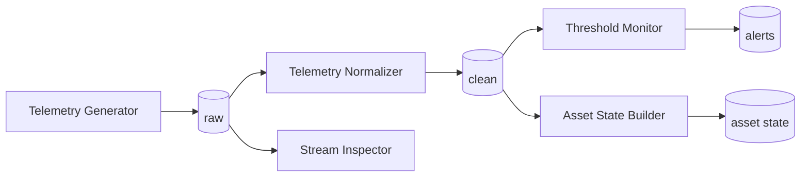

# Processor catalogue

**Initialize Resources** gives every user editable copies of six open-source processors, plus the WME-managed **Logstash Pipeline**. All six live in `github.com/datacrop/maize-processor-*` (Apache-2.0), run as **Compose applications** from the repository root on branch `main`, and follow the same conventions: Python 3.12, a non-root user, `confluent-kafka`, JSON logs on stdout, and a health check on `/tmp/processor-ready`.



Defaults below are the compose defaults; the definitions seeded in WME may use different defaults (for example the generator is seeded with asset `demo-asset`, unit `C` and a 15–35 range).

## Telemetry Generator

`maize-processor-telemetry-generator` · Data Analytics · **In:** — · **Out:** Kafka

Publishes synthetic *Telemetry Event* JSON records, with occasional anomalies.

| Parameter | Default | Meaning |
|---|---|---|
| `ASSET_ID`, `ASSET_NAME` | `machine-01` | Asset reported on each event |
| `METRIC`, `UNIT` | `temperature`, `celsius` | Metric name and unit |
| `MIN_VALUE`, `MAX_VALUE` | `20`, `90` | Value range |
| `INTERVAL_SECONDS` | `2` | Time between events |
| `ANOMALY_RATE` | `0.05` | Share of anomalous values |
| `RANDOM_SEED` | `42` | Deterministic output |
| `MAX_EVENTS` | `0` | Stop after N events (0 = never) |

Also reads `KAFKA_SECURITY_PROTOCOL_OUTPUT`, `KAFKA_SASL_MECHANISM_OUTPUT`, `KAFKA_SASL_USERNAME_OUTPUT`, `KAFKA_SASL_PASSWORD_OUTPUT`.

## Telemetry Normalizer

`maize-processor-telemetry-normalizer` · Data Analytics · **In:** Kafka · **Out:** Kafka

Validates records (timestamp, numeric value), applies `value × VALUE_MULTIPLIER + VALUE_OFFSET` and optionally renames the metric/unit.

| Parameter | Default | Meaning |
|---|---|---|
| `CONSUMER_GROUP_ID` | — (required) | Kafka consumer group — unique per instance |
| `AUTO_OFFSET_RESET` | `earliest` | Where a new group starts |
| `OUTPUT_METRIC`, `OUTPUT_UNIT` | — | Replacement metric / unit |
| `VALUE_MULTIPLIER`, `VALUE_OFFSET` | `1`, `0` | Linear transform |
| `INVALID_RECORD_POLICY` | `skip` | `skip` or `fail` |

## Threshold Monitor

`maize-processor-threshold-monitor` · Data Analytics · **In:** Kafka · **Out:** Kafka

Emits `threshold-alert` events when a metric crosses warning/critical thresholds, with a cooldown.

| Parameter | Default |
|---|---|
| `CONSUMER_GROUP_ID`, `AUTO_OFFSET_RESET` | —, `earliest` |
| `METRIC` | metric to watch |
| `COMPARISON` | `above` or `below` |
| `WARNING_THRESHOLD`, `CRITICAL_THRESHOLD` | `70`, `90` |
| `COOLDOWN_SECONDS` | `60` |

## Stream Inspector

`maize-processor-stream-inspector` · Data Analytics · **In:** Kafka · **Out:** —

A sink that prints bounded records and periodic counters to stdout — ideal for checking a topic from **Worker Runtime**.

| Parameter | Default |
|---|---|
| `CONSUMER_GROUP_ID`, `AUTO_OFFSET_RESET` | —, `earliest` |
| `LOG_FORMAT` | `json` or `text` |
| `INCLUDE_FIELDS` | fields to print (empty = all) |
| `MAX_VALUE_LENGTH` | `1000` |
| `SUMMARY_INTERVAL_SECONDS` | `30` |

## Asset State Builder

`maize-processor-asset-state-builder` · Data Modeling · **In:** Kafka · **Out:** Kafka

Keeps the latest state per asset in a Redis sidecar (`redis:7.4-alpine` with a volume) and emits *Asset State* records (`active` / `stale`).

| Parameter | Default |
|---|---|
| `CONSUMER_GROUP_ID`, `AUTO_OFFSET_RESET` | —, `earliest` |
| `STATE_TTL_SECONDS` | `86400` |
| `STALE_AFTER_SECONDS` | `300` |
| `EMIT_INTERVAL_SECONDS` | `10` |

## Apache Kafka + AKHQ

`maize-processor-kafka-akhq` · Data Persistence · **In:** — · **Out:** —

Infrastructure as a processor: Kafka 4.3.1 (KRaft) and AKHQ 0.27.1 on a worker — useful for an extra, workflow-local broker.

| Parameter | Default |
|---|---|
| `KAFKA_EXTERNAL_PORT`, `AKHQ_EXTERNAL_PORT` | `19092`, `18081` |
| `KAFKA_ADVERTISED_HOST` | `localhost` — set to the worker's address |
| `KAFKA_AUTO_CREATE_TOPICS_ENABLE` | `true` |
| `KAFKA_NUM_PARTITIONS` | `3` |

## Logstash Pipeline (WME managed)

Not a repository: WME generates a Logstash pipeline from the processor's inputs, outputs and optional `logstash_filter`; `active` pauses or resumes it. See [Logstash pipelines](/user-guide/logstash-pipelines/).

## Repository layout

Each bundled processor has the same layout — a good template for your own:

```text
maize-processor-<name>/
├─ compose.yaml          # maps every variable with ${VAR:-default}
├─ Dockerfile
├─ requirements.txt
├─ src/
│  ├─ app.py             # reads env, connects, touches /tmp/processor-ready
│  └─ healthcheck.py
├─ tests/
└─ .github/workflows/test.yml   # ruff, pytest, docker compose config/build
```
