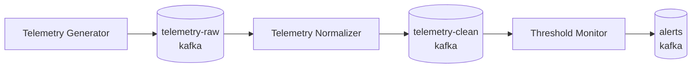

# Walkthrough: your first workflow

In this walkthrough you build a small but realistic pipeline and learn the main screens of the editor on the way:

:::tip[Before you start]
You need a running deployment with an initialized catalogue and at least one registered worker. If you have not done that yet, follow the [Quickstart](/getting-started/quickstart/) steps 1–4.
:::

## Step 1 — Look at the catalogue

Open **Warehouse**. Its tabs are your catalogue: **Workflows**, **Digital Resources**, **Workers**, **Data Kinds**, **Processor Definitions** and (admins only) **Data Interface Types**.

<Screenshot src="/img/screens/processor-definitions.jpg" caption="Processor Definitions: the processors available to your workflows. Built-in ones are marked WME managed." />

Open **Telemetry Generator** to see how a processor is described: its **Runtime** (a Compose application cloned from GitHub), its supported **Interfaces** and its **Parameters**, each of which becomes an environment variable. You do not need to change anything — close the wizard with **Cancel**.

<Screenshot src="/img/screens/pd-runtime.jpg" caption="Runtime step: run one Docker image, or clone and run a Compose application from GitHub." />

## Step 2 — Describe the data

Create three Kafka resources in **Warehouse → Digital Resources** (`telemetry-raw`, `telemetry-clean`, `alerts`). For each one choose interface type **kafka**, click **Use default WME instance** to fill the bundled broker address, set the **Topic**, and pick a **Data Kind** (`Telemetry Event` for the first two, `Telemetry Event` or a kind of your own for alerts).

<Screenshot src="/img/screens/resource-form.jpg" caption="A Kafka digital resource: connection parameters are grouped into Connection, Authentication, Data location and Advanced." />

The data kind's schema is shown read-only at the bottom of the form, so whoever uses this resource knows what the payload looks like.

<Screenshot src="/img/screens/resource-schema.jpg" caption="The linked data kind and its JSON Schema." />

## Step 3 — Compose the workflow

**Workflows → Create New Workflow** opens the **Workflow Lab**.

1. On **1. Workflow Details** set a name (`Field telemetry`) and a description. Leave **Requires Scheduler** off to run on demand.
2. Switch to **2. Flow Creator**. Drag the three processors from the *Presets* panel and the three resources from *Digital Resources* onto the canvas.
3. Connect them as in the diagram above. The editor only lets you draw links that make sense: two resources can never be linked directly, and a resource can only be connected to a processor whose definition supports its interface type. If you drag from one processor straight to another, the **Connect processors** dialog lets you pick (or create) a resource compatible with both and inserts it between them.

<Screenshot src="/img/screens/lab-canvas.jpg" caption="A larger workflow in the Flow Creator: processors are cards, digital resources are pills." />

## Step 4 — Configure each processor

Double-click a processor to open its form.

- **Deployment → Worker Station**: the worker this processor runs on. Different processors of the same workflow may run on different workers.
- **Data Flow**: the input and output resources (already filled from your connections).
- **Processor Parameters**: the definition's parameters, with their environment-variable names. **Use Defaults** fills the default values. Set a **Consumer group** for the normalizer and the threshold monitor.

<Screenshot src="/img/screens/pm-params.jpg" caption="Processor parameters map one-to-one to environment variables." />

Scroll down to **Derived Environment Variables**. These are generated from the connected resources and injected into the container at runtime — this is how the normalizer learns which Kafka topic to read and which to write, without you configuring it twice.

<Screenshot src="/img/screens/pm-derived.jpg" caption="Derived environment variables follow <INTERFACE>_<KEY>_<DIRECTION>." />

## Step 5 — Save, run and watch

1. Click **Save**. WME generates a deploy DAG and a teardown DAG and sends them to Airflow and every worker. **Run** stays disabled for a short countdown while Airflow loads the DAG, and until every processor's code is provisioned on its worker.
2. Click **Run**.
3. Open **3. Airflow Runs**: each processor is a step; click one to read its log.

<Screenshot src="/img/screens/airflow-runs.jpg" caption="Deployment and teardown runs, steps and per-step logs." />

4. Open **Worker Runtime** to see the containers on each worker, their health and their output. The generator logs every event it publishes.

## Step 6 — Change and stop

- Change a parameter (for example the threshold monitor's **WARNING_THRESHOLD**), click **Update** and **Run** again to redeploy.
- **Stop** runs the teardown DAG and removes the containers.
- **Save as Template** (bottom right of the canvas) stores the graph so you can create similar workflows from **Warehouse → Workflows → Create Workflow from Template**.

## What you learned

- Processors and data sources are catalogue objects; workflows connect instances of them.
- Connections become environment variables automatically.
- Saving generates Airflow DAGs; running deploys containers on the chosen workers.
- Airflow Runs and Worker Runtime show you what happened.

Continue with [Observe your data](/getting-started/observe-data/).
