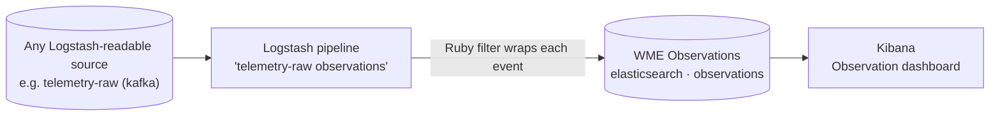

# Walkthrough: observe your data

Processors exchange data through Kafka topics, Elasticsearch indices and other resources. **Observations** let you see that traffic: WME copies every event of a source into a common `observations` index, tagged with where it came from, and builds a Kibana dashboard on top of it.

## 1. Create observations

1. Open the workflow from the [previous walkthrough](/getting-started/first-workflow/) in the **Workflow Lab → Flow Creator**.
2. Hover the `telemetry-raw` resource. A **Create observations** button appears below it. Click it.
3. If several processors or workers could be the source of the events, WME asks you to **Select observation source** — the asset recorded on each observation.

WME adds two nodes: a **Logstash Pipeline** processor named `telemetry-raw observations` and a shared **WME Observations** resource (Elasticsearch, index `observations`, data kind `Observation`).

<Screenshot src="/img/screens/logstash-filter.jpg" caption="The generated Logstash filter turns every event into an Observation document." />

The generated filter keeps the original event as a JSON string in `value` and adds `id`, `digitalResourceID/Name`, `assetID/Name`, `dataKindID/Name` and `timestamp`.

## 2. Save

Click **Update**. Logstash pipelines do not go through Airflow: the backend regenerates the pipeline file and Logstash reloads within seconds. The pipeline node shows a green live indicator; hover it to pause or resume the pipeline.

<Screenshot src="/img/screens/lab-logstash-active.jpg" caption="Logstash pipeline nodes show whether they are active; hover to toggle." />

## 3. Check the pipeline

Open **Logstash Monitor**. The new pipeline should be **Running**, with **Events In** and **Events Out** increasing.

<Screenshot src="/img/screens/logstash-monitor.jpg" caption="Logstash Monitor: status, active toggle and event counters per pipeline." />

## 4. Explore in Kibana

Open **Kibana Visualizations**. Every Elasticsearch resource you own is listed. Click **WME Observations**: WME creates the Kibana data view if needed and opens the **Observation dashboard** — observations over time, per asset, per digital resource and per data kind, plus a saved search of the raw records.

<Screenshot src="/img/screens/kibana-catalog.jpg" caption="Kibana Visualizations: pick a source to open it in Kibana." />

Use the view selector to switch to **Discover records** or **Build dashboard**. Any other Elasticsearch index with a time field gets a **Timestamp overview** dashboard instead.

Read more: [Observations](/user-guide/observations/) · [Kibana visualizations](/user-guide/kibana/).
