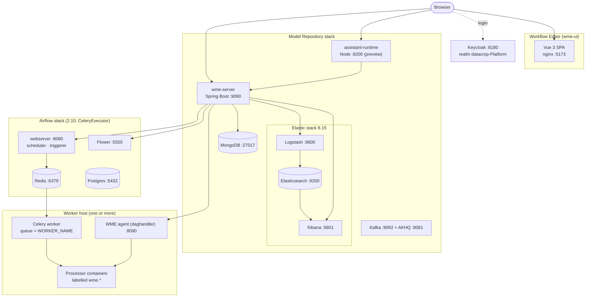
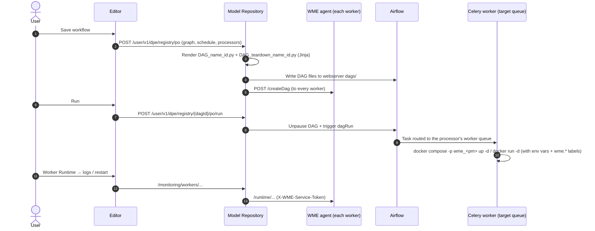

# Architecture

A WME deployment is a handful of Docker Compose stacks. The browser loads the editor and then calls the backend (the **Model Repository**) directly, plus the assistant runtime that is deployed alongside it; the backend talks to everything else.

## Components

| Component | Responsibility | Repository |
|---|---|---|
| **Workflow Editor** (`wme-ui`) | Vue 3 + Vuetify single-page app: Warehouse, Workflow Lab, monitoring pages, settings. Runtime configuration is injected at container start via `env-config.js`. | `maize-workflow-management-editor/ui` |
| **assistant-runtime** *(preview)* | Node service (CopilotKit + Vercel AI SDK) behind the Workflow Assistant chat. Deployed in the Model Repository stack next to `wme-server`; the browser calls it directly (CORS), like the backend API. Validates the user's Keycloak token and calls the backend for every tool and model call. | `maize-model-repository/assistant-runtime` |
| **Model Repository** (`wme-server`) | Spring Boot 3 / Java 17 REST API. Owns the catalogue in MongoDB, renders Airflow DAGs, provisions workers, generates Logstash pipelines, builds Kibana dashboards, encrypts secrets, relays worker runtime calls. | `maize-model-repository` |
| **Keycloak** | OpenID Connect login; issues the JWTs the editor and backend use. The MVP imports a ready realm. | `maize-mvp/Keycloak` |
| **Elastic stack** | Logstash runs WME-generated pipelines; Elasticsearch stores observations and pipeline output; Kibana shows auto-built dashboards. | `maize-model-repository/docker-elk` |
| **Kafka + AKHQ** | Default message bus used by the bundled processors, with a web UI. | `maize-model-repository` |
| **Airflow** | Schedules and runs the deploy/teardown DAGs WME generates, dispatching tasks to worker queues through Celery. Flower exposes the live worker list WME imports. | `maize-processing-engine-airflow` |
| **Worker** | A Celery worker that executes DAG tasks (`docker compose up`, `docker run`, …) plus the **WME agent**, a small Go service that receives DAG files, clones processor repositories and serves container status, logs and start/stop/restart. | `maize-processing-engine-worker` |

## From "Save" to running containers

Key points:

- **Processor code is provisioned ahead of time.** When a GitHub-based processor definition is saved (or a new worker is registered) the backend asks every worker's agent to clone the repository into `processors/pd_<id>`.
- **Each processor runs on exactly one worker**, chosen in its *Worker Station* field. A single workflow can spread its processors across many workers; the DAG task for each processor carries that worker's Celery queue.
- **Connected digital resources become environment variables** following `<INTERFACE>_<KEY>_<DIRECTION>`; they override parameters with the same key.
- **Containers are labelled** (`wme.managed`, `wme.processor-manifest-id`, `wme.workflow-id`, …) so Worker Runtime can match containers to processors and detect orphans.
- **Logstash pipelines bypass Airflow**: saving a Logstash Pipeline processor regenerates its `.conf` file and `pipelines.yml`, and Logstash reloads.

The full deployment internals are in [How deployment works](/developers/how-deployment-works/).
