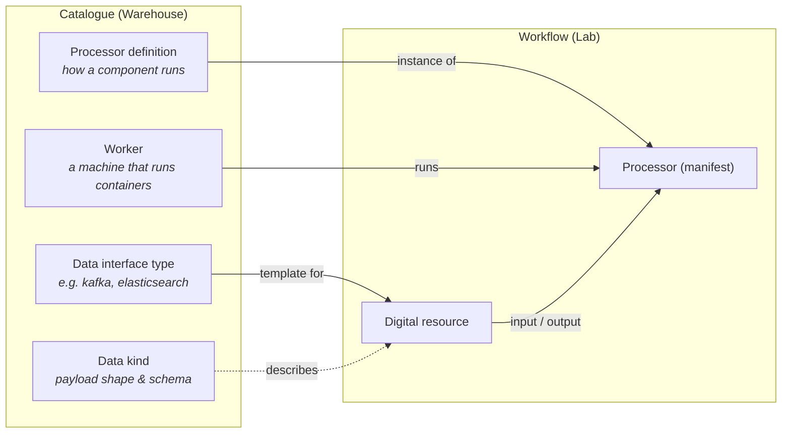

# Key concepts

WME has a small vocabulary. Most objects come in pairs: a reusable **definition** in the catalogue and a configured **instance** used in a workflow.



## Processors

| Term | Meaning |
|---|---|
| **Processor definition** | A catalogue entry describing a processing component as a black box: its **runtime** (a single container image, or a Docker Compose application cloned from GitHub), the **data interfaces** it accepts and produces, and the **parameters** it needs (each parameter becomes an environment variable). |
| **Processor** (processor manifest) | A configured instance of a definition placed in a workflow. It chooses a **worker station**, sets parameter values and lists its **data input** and **data output** digital resources. |
| **Logstash Pipeline** | A built-in, WME-managed processor type. Instead of running your code, WME generates a Logstash pipeline from the connected inputs/outputs plus an optional filter. It does not need a worker. |

## Data

| Term | Meaning |
|---|---|
| **Data interface type** | A template for a kind of endpoint — `kafka`, `elasticsearch`, `mqtt`, `mongodb`, `s3`, `redis`, `rabbitmq`, `http`, `beats` — listing its connection parameters and whether Logstash can read/write it. See [Interface types](/reference/interface-types/). |
| **Digital resource** | A concrete data source or sink: an interface type plus real values (servers, topic, index, credentials…). |
| **Data kind** | Describes the data a resource carries: payload shape, cardinality and a schema (JSON Schema, CSV columns, XML/XSD or Avro). See [Data kinds](/reference/data-kinds/). |
| **Observation** | A normalized record describing one event that flowed through the system (source, asset, data kind, timestamp, original value), stored in the `observations` Elasticsearch index. |

## Execution

| Term | Meaning |
|---|---|
| **Workflow** | A graph of processors and digital resources plus scheduling settings. Saving it generates two Airflow DAGs: **deploy** and **teardown**. |
| **Worker** | A host that runs processor containers. It runs an Airflow **Celery worker** (one queue per worker) and the **WME agent**, which receives DAGs, clones processor repositories and controls containers. |
| **Provisioning** | Copying a processor definition's code (its GitHub repository) onto every registered worker so it is ready to run. |
| **Workflow template** | A reusable graph you can instantiate into new workflows. |

## How connections become configuration

Every parameter of a connected digital resource is passed to the processor container as an environment variable named:

```text
<INTERFACE>_<KEY>_<DIRECTION>
```

For a Kafka resource used as input that means `KAFKA_BOOTSTRAP_SERVERS_INPUT`, `KAFKA_TOPIC_ID_INPUT`, and so on; for an Elasticsearch output, `ELASTICSEARCH_INDEX_OUTPUT`. Your processor code only reads environment variables — it never needs to know which concrete resource it was connected to. See [Environment variable convention](/reference/env-var-convention/).

## Ownership and visibility

Catalogue objects are scoped to the Keycloak user who created them. Processor definitions show an ownership chip: **Mine**, **Shared** (read-only — duplicate it to get an editable copy) or **WME managed** (built-in). Administrators additionally see the **Data Interface Types** tab, the **Airflow DAGs** page and the **Initialize Resources** action.
