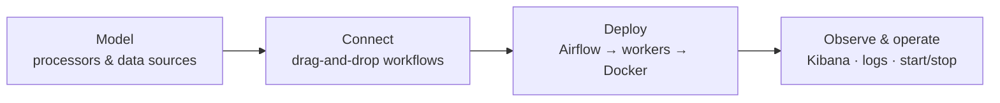

# What is DataCROP Maize?

**DataCROP™** (Data Collection Routing & Processing) is a framework for collecting, transforming, routing and storing data in real time. **Maize** is its third generation. Its core is the **Workflow Management Engine (WME)**: a web editor plus a set of backend services that let you describe data-processing pipelines visually and run them on your own machines.

<VideoEmbed />

## The idea in one paragraph

WME treats every processing component — a machine-learning model, an LLM service, a plain Python script — as a **black box** with declared inputs, outputs and settings. Data sources and sinks (Kafka topics, Elasticsearch indices, MQTT brokers, S3 buckets…) are modelled too, together with the shape of the data they carry. You then **connect** components and data sources on a drag-and-drop canvas. **Save** stores the workflow and generates its deployment and teardown DAGs. **Run** triggers Airflow to start each processor as Docker containers on the worker machine you chose, wiring the connection details of every connected data source into the container as environment variables. Managed Logstash pipelines take effect when saved. Finally, you **observe** what flows through the system in Kibana and operate the running containers from the editor.

## What you can do with it

| You want to… | WME gives you… | Read |
|---|---|---|
| Reuse existing code as a pipeline step | **Processor definitions** that run a container image or a Docker Compose app cloned from GitHub | [Processor definitions](/user-guide/warehouse/processor-definitions/) |
| Describe where data lives | **Digital resources** for 9 interface types (Kafka, Elasticsearch, MQTT, MongoDB, S3, Redis, RabbitMQ, HTTP, Beats) plus **data kinds** with schemas | [Digital resources](/user-guide/warehouse/digital-resources/) |
| Build a pipeline | A **visual workflow editor** that only allows compatible connections and injects connection settings automatically | [Flow creator](/user-guide/workflow-lab/flow-creator/) |
| Run it on your machines | One-click deployment through **Apache Airflow** to any number of **worker** hosts, once or on a schedule | [Run and monitor](/user-guide/workflow-lab/run-and-monitor/) |
| Move data without writing code | Managed **Logstash pipelines** with an **AI filter assistant** | [Logstash pipelines](/user-guide/logstash-pipelines/) |
| See what actually flows | **Observations** and auto-built **Kibana** dashboards | [Observations](/user-guide/observations/) |
| Keep it running | **Worker Runtime** (containers, health, logs, start/stop/restart), Airflow run history and a Logstash pipeline monitor | [Worker Runtime](/user-guide/worker-runtime/) |
| Skip the clicking | A **Workflow Assistant (Preview)** that drafts workflows from a description | [Workflow Assistant](/user-guide/workflow-assistant/) |

## Where to go next

- **New here?** Read [Key concepts](/intro/key-concepts/), then follow the [Quickstart](/getting-started/quickstart/).
- **Deploying WME?** Start at [Deploy](/deploy/).
- **Packaging your own processor?** See [Writing processors](/developers/writing-processors/).
- **Curious how it works inside?** See [Architecture](/intro/architecture/).
