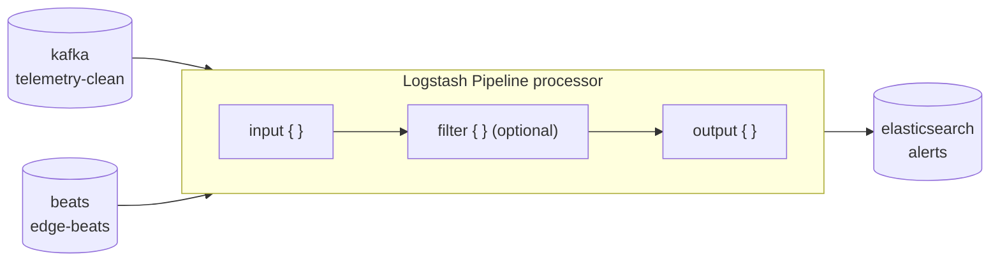

# Logstash pipelines

**Logstash Pipeline** is a built-in, WME-managed processor. Instead of running your code, it turns its connected digital resources into a Logstash pipeline: every **input** resource becomes a Logstash input, every **output** resource a Logstash output, with an optional **filter** in between. Use it to copy, route or reshape data — for example from Kafka into Elasticsearch — without writing a processor.



Logstash pipelines run continuously while active and do **not** go through Airflow or a worker: saving the processor regenerates its pipeline file and Logstash reloads within seconds.

## Create one

1. In the **Flow Creator**, drag **Logstash Pipeline** from *Presets* (category *Datacrop Service*).
2. Connect input resources to it and connect it to output resources — only Logstash-compatible types are accepted (see below).
3. Double-click it, give it a **Name**, and optionally write a filter (next section).
4. **Save / Update** the workflow.

<Screenshot src="/img/screens/lab-logstash-active.jpg" caption="An active Logstash pipeline node (green indicator). Hover to pause it." />

## Compatible interface types

| Type | Input | Output |
|---|:-:|:-:|
| `elasticsearch` | ✓ | ✓ |
| `kafka` | ✓ | ✓ |
| `http` | ✓ | ✓ |
| `s3` | ✓ | ✓ |
| `redis` | ✓ | ✓ |
| `rabbitmq` | ✓ | ✓ |
| `beats` | ✓ | — |
| `mongodb` | — | — |
| `mqtt` | — | — |

The processor form and the backend both enforce this. Administrators can mark custom interface types as Logstash-compatible in [Data interface types](/user-guide/warehouse/data-interface-types/).

## The filter

The **Logstash Filter Configuration** section accepts **filter plugin content only** — no surrounding `filter { }`, and no `input { }` / `output { }` blocks.

<Screenshot src="/img/screens/logstash-filter.jpg" caption="Filter editor (here: an auto-generated observation filter)." />

```ruby
mutate {
  add_field => { "environment" => "production" }
}
date {
  match => ["timestamp", "ISO8601"]
}
```

Controls: **Enable Custom Filter** (include the filter in the pipeline), **Reset to Default**, **Collapse**, and **AI Assistant**, which opens the [AI Logstash assistant](/user-guide/logstash-pipelines/ai-assistant/).

## Active / paused

The pipeline's `active` parameter decides whether Logstash loads it:

- Toggle it from the node on the canvas (hover → **Active / Paused**), from the **Logstash Monitor**, or in the processor's parameter table.
- A paused pipeline keeps its configuration; it is simply left out of `pipelines.yml`. Paused nodes are drawn with a dashed outline.

## Empty pipelines

A pipeline with no eligible input, no eligible output and no filter produces no file and is left out of `pipelines.yml`, which avoids Logstash's "Missing Filter End Vertex" error. Add an input, an output or a filter and save to create it.

## Monitor it

Open [Logstash Monitor](/user-guide/logstash-monitor/) to check that the pipeline is **Running** and that **Events In / Out** increase.

## How the files are generated

On every save or delete of a Logstash Pipeline processor the backend:

1. loads all Logstash Pipeline processors;
2. resolves their eligible input and output resources from the interface-type capabilities;
3. renders `<name>_<id>.conf` from a template, passing only the settings each Logstash plugin supports;
4. rewrites `pipelines.yml` with the active, non-empty pipelines.

A file monitor next to Logstash detects the change and restarts Logstash. See [Model Repository operations](/developers/model-repository/operations/).

## Troubleshooting

- **A resource does not appear in Data Input / Output** — its interface type is not Logstash-compatible in that direction (MQTT and MongoDB are not).
- **The pipeline does not start** — check it is active and has at least one eligible input, output or a filter.
- **Logstash reports an error after saving** — usually invalid filter syntax; ask the AI assistant to *explain* or *fix* the filter.
