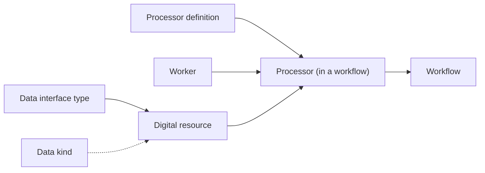

# Warehouse

The Warehouse is your catalogue. Each tab is a searchable, paginated table with a **Search by Name** box, a **Creation Date** filter and **Apply Filters**.

| Tab | Holds | Page |
|---|---|---|
| **Workflows** | Saved workflows and workflow templates | [Workflows](/user-guide/warehouse/workflows/) |
| **Digital Resources** | Concrete data sources and sinks | [Digital resources](/user-guide/warehouse/digital-resources/) |
| **Workers** | Machines that run processor containers | [Workers](/user-guide/warehouse/workers/) |
| **Data Kinds** | Payload descriptions and schemas | [Data kinds](/user-guide/warehouse/data-kinds/) |
| **Processor Definitions** *(Catalog)* | Reusable processing components | [Processor definitions](/user-guide/warehouse/processor-definitions/) |
| **Data Interface Types** *(Admin)* | Templates for kinds of endpoints | [Data interface types](/user-guide/warehouse/data-interface-types/) |

## Row actions

Click a row (or its **open** icon) to open the item's form; for workflows this loads the workflow in the **Workflow Lab**. Other icons in the **Actions** column:

| Icon | Meaning | Where |
|---|---|---|
| Rocket | **Deploy** — run the workflow's deployment DAG | Workflows |
| Stop | **Stop** — run the teardown DAG | Workflows |
| Duplicate | Create an editable copy | All catalogue tabs |
| Trash | Delete (asks for confirmation; processor definitions in use cannot be deleted) | All tabs |
| Chart | Open in Kibana | Elasticsearch digital resources |
| AKHQ | Open the topic in AKHQ | Kafka digital resources |

Workflow rows also show the status of the five most recent **deployments** and **teardowns** as coloured dots.

## Dependencies between objects

If the Warehouse shows an initialization warning, run [Initialize Resources](/user-guide/settings/#initialize-resources) first: it creates the interface types, data kinds and worker category everything else depends on.
